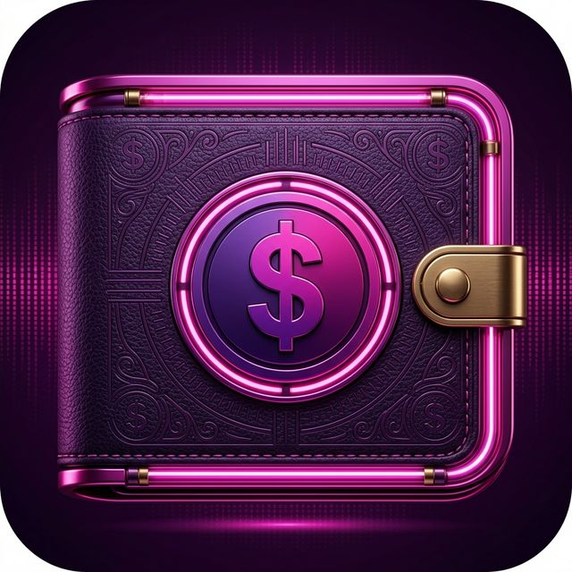

<p align="center">
  
</p>

<h1 align="center">💜 SpendWise</h1>

<p align="center">
  <em>Track Wisely, Spend Better.</em>
</p>

<p align="center">
  
  
  
  
  
</p>

---

## 📖 About

**SpendWise** is a modern, feature-rich personal finance tracker built with Flutter. Designed with an elegant dark theme and neon-magenta accents, SpendWise helps you monitor your daily expenses and income with clarity and style.

> 🧪 **Built with cutting-edge AI tools:**
> - **[Google Stitch](https://stitch.withgoogle.com/)** — Used to generate the initial UI/UX design mockups, which were then translated into Flutter widgets.
> - **[Antigravity](https://blog.google/technology/google-deepmind/antigravity/)** — Google DeepMind's agentic AI coding assistant that powered the entire development workflow, from architecture planning, code generation, debugging, to final APK production.

---

## ✨ Features

### 🏠 Dashboard
- Real-time **Total Balance**, **Income**, and **Expense** overview
- Balance turns **red** automatically when you're in the negative
- Quick-access floating button to add new transactions

### 📊 Breakdown & Analytics
- Beautiful **interactive donut chart** for expense categories
- **Top 5 Categories** at a glance, expandable to view all
- **Month picker** to filter analysis by specific months
- Tap any category to jump directly to filtered transaction history

### 📝 Transaction Management
- Full **CRUD operations** — Add, Edit, Delete transactions
- Support for **Income** and **Expense** types
- Categorized with icons: 🍔 Food, 🚗 Transport, 🛒 Shopping, 💊 Health, and more
- Optional **notes** and **photo attachments** via camera or gallery
- **Swipe-to-delete** with undo support

### 📅 History & Filtering
- Chronological transaction list grouped by date (Today, Yesterday, etc.)
- **Month-based filtering** with an intuitive calendar picker
- **Category filtering** from Breakdown deep-links
- Search functionality across all transactions

### 🔔 Smart Notifications
- **Daily Reminders** at 10 AM, 4 PM, and 9 PM to log your expenses
- **Budget Alerts** — Instant notification when your balance goes negative
- **Weekly Reports** — Daily 10 PM summary of your spending
- All toggleable from the Settings screen

### ⚙️ Settings
- **Currency selector** (IDR, USD, EUR, GBP, JPY, and more)
- **Notification preferences** with individual toggles
- **App information** and version details

### 💾 Local Data Persistence
- All transactions are **automatically saved** to device storage
- Data persists across app restarts — no data loss
- Powered by `SharedPreferences` with JSON serialization

---

## 🛠️ Tech Stack

| Layer | Technology |
|---|---|
| **Framework** | Flutter 3.x |
| **Language** | Dart 3.x |
| **State Management** | ChangeNotifier + Provider pattern |
| **Charts** | fl_chart |
| **Local Storage** | SharedPreferences |
| **Notifications** | flutter_local_notifications + timezone |
| **Typography** | Google Fonts (Outfit, Inter) |
| **UI Design** | Google Stitch (AI-generated mockups) |
| **Development** | Antigravity (AI-powered coding agent) |

---

## 🚀 Getting Started

### Prerequisites
- Flutter SDK 3.x or higher
- Android Studio / VS Code
- An Android device or emulator

### Installation

```bash
# Clone the repository
git clone https://github.com/naufal-fa/SpendWise.git
cd SpendWise

# Install dependencies
flutter pub get

# Run in debug mode
flutter run

# Build release APK
flutter build apk --release --no-tree-shake-icons
```

The release APK will be generated at:
```
build/app/outputs/flutter-apk/app-release.apk
```

---

## 📁 Project Structure

```
lib/
├── core/
│   ├── app_colors.dart         # Color palette & glow effects
│   └── app_theme.dart          # Global dark theme configuration
├── models/
│   └── transaction_model.dart  # Transaction data model with JSON serialization
├── providers/
│   ├── currency_provider.dart  # Multi-currency support
│   └── transaction_provider.dart # State management + local persistence
├── screens/
│   ├── splash_screen.dart      # Animated splash with glow effects
│   ├── dashboard_screen.dart   # Home screen with balance overview
│   ├── breakdown_screen.dart   # Analytics with donut chart
│   ├── history_screen.dart     # Transaction history with filters
│   ├── add_transaction_screen.dart # Add/Edit transaction form
│   └── settings_screen.dart    # App preferences & notifications
├── services/
│   └── notification_service.dart # Local notification scheduling
├── widgets/
│   └── month_year_picker_sheet.dart # Custom month picker bottom sheet
└── main.dart                   # App entry point & navigation shell
```

---

## 🎨 Design Philosophy

SpendWise embraces a **premium dark theme** aesthetic with:
- 🟣 Neon magenta (#F20DB9) as the primary accent
- 🌑 Deep dark backgrounds for reduced eye strain
- ✨ Glassmorphism-inspired card surfaces
- 💫 Glow effects and smooth micro-animations
- 📱 Responsive layouts optimized for all screen sizes

---

## 👨‍💻 Author

**Naufal Falah Anwar**

---

## 📄 License

This project is open source and available for educational purposes.

---

<p align="center">
  <strong>SpendWise</strong> — Because every rupiah counts. 💜
</p>
